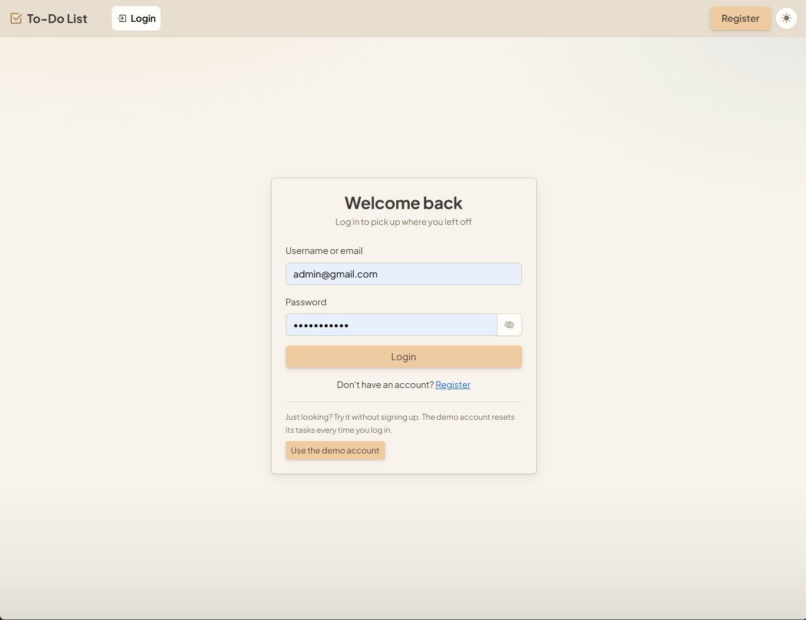
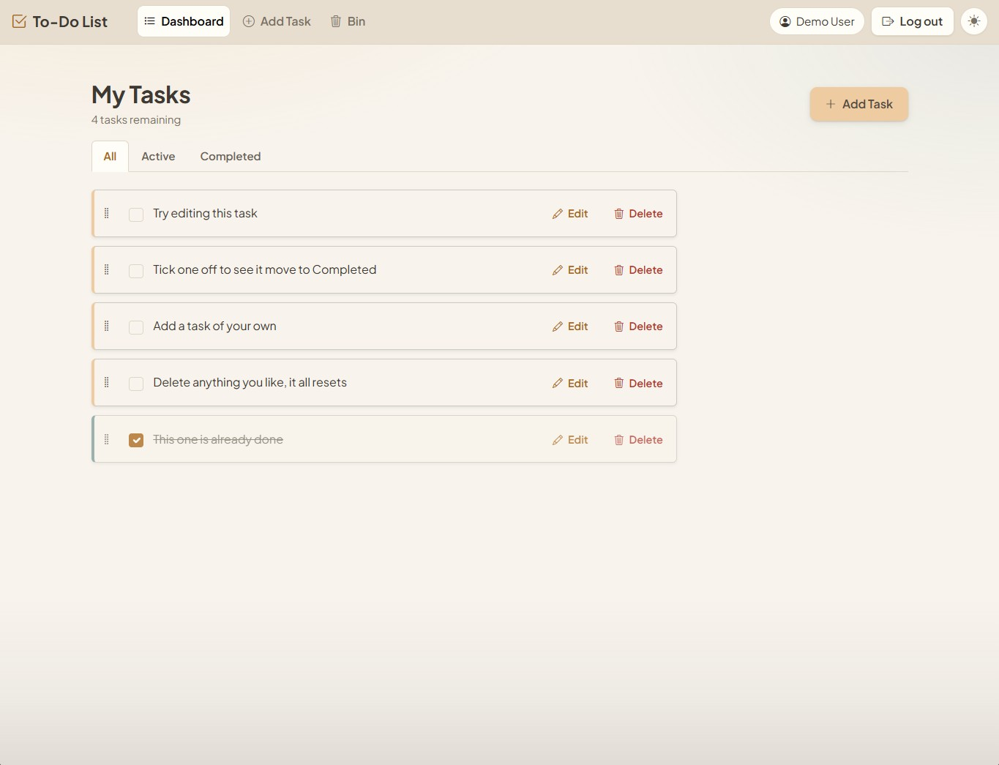
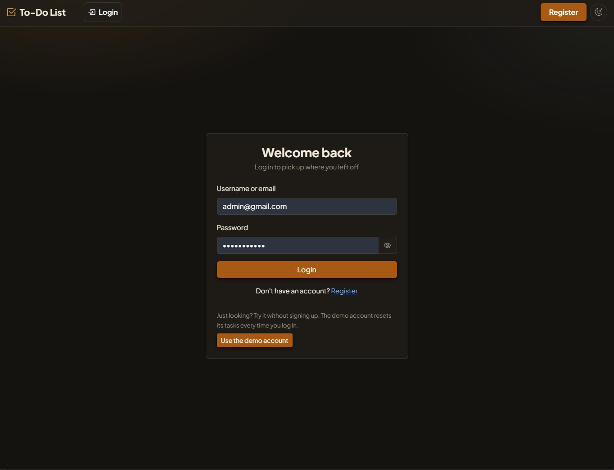
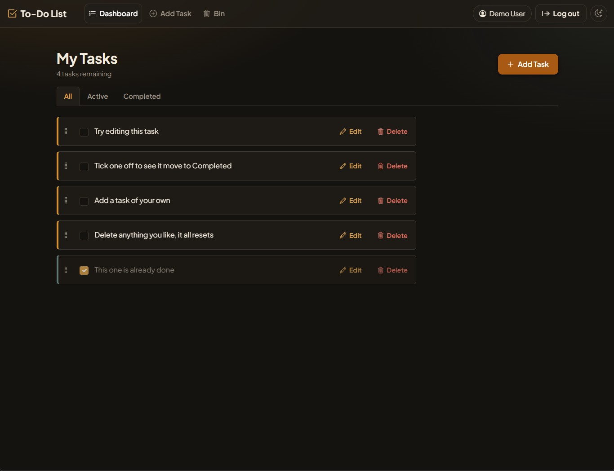

# To-Do List App

A full-stack MERN task manager with JWT authentication, protected API routes,
drag and drop ordering, a recycle bin, and light and dark themes.

**[Live demo](https://to-do-tasks-szstanton.vercel.app/)**

The login page has a one click demo sign in, so you can look around without
creating an account. The API is on a free tier that sleeps when idle, so the
first load can take up to a minute while it wakes.

If you do create an account, it and its tasks are deleted after 60 days of
inactivity. Nothing personal is kept indefinitely.

## Screenshots

<table>
  <tr>
    <td align="center">
      <strong>Login, light</strong><br/>
      
    </td>
    <td align="center">
      <strong>Dashboard, light</strong><br/>
      
    </td>
  </tr>
  <tr>
    <td align="center">
      <strong>Login, dark</strong><br/>
      
    </td>
    <td align="center">
      <strong>Dashboard, dark</strong><br/>
      
    </td>
  </tr>
</table>

## Features

- User registration and login with JWT authentication
- Create, edit, complete and delete tasks
- Drag and drop reordering, operable by keyboard
- Recycle bin, restorable for 24 hours before it clears itself
- Filtering and a remaining task counter
- Light and dark themes, remembered between visits
- Rate limited authentication and protected API routes

## Tech Stack

| Area       | Technologies                           |
| ---------- | -------------------------------------- |
| Frontend   | React, Vite, React Router, Context API |
| Backend    | Node.js, Express, Mongoose             |
| Database   | MongoDB Atlas                          |
| Styling    | Bootstrap, CSS custom properties       |
| Validation | Zod                                    |
| Testing    | Vitest, Testing Library                |
| Deployment | Vercel, Render                         |

## Getting Started

Requires Node 24 and a MongoDB Atlas cluster.

```bash
git clone https://github.com/SZStanton/To-Do-Tasks
cd To-Do-Tasks
npm install
```

Create the environment files and fill them in:

```bash
cp server/.env.example server/.env
cp client/.env.example client/.env
```

| Variable                     | Where         | Notes                            |
| ---------------------------- | ------------- | -------------------------------- |
| `MONGO_URI`                  | `server/.env` | include the database name        |
| `JWT_SECRET`                 | `server/.env` | any long random string           |
| `VITE_API_URL`               | `client/.env` | the API's URL, no trailing slash |
| `DEMO_USERNAME`, `_PASSWORD` | both          | optional, enables the demo login |

Then run both halves together:

```bash
npm run dev        # api and frontend
npm test           # test suite
npm run build      # production build of the frontend
```

## Testing

Vitest and Testing Library, covering the validation schemas, a cross check that
the client and server validation produce identical messages, and the key
components.

```bash
npm test
```

## What I Learned

- Building a complete authentication flow, from registering an account through
  logging in and out, with a session that survives a page reload
- Implementing JWT authentication and protecting Express routes with middleware
- Designing a MongoDB data model, including soft deletes and TTL indexes for
  automatic cleanup
- Sharing one set of validation rules between client and server, with tests that
  fail if the two ever disagree
- Deploying a full stack application across Vercel, Render and Atlas
