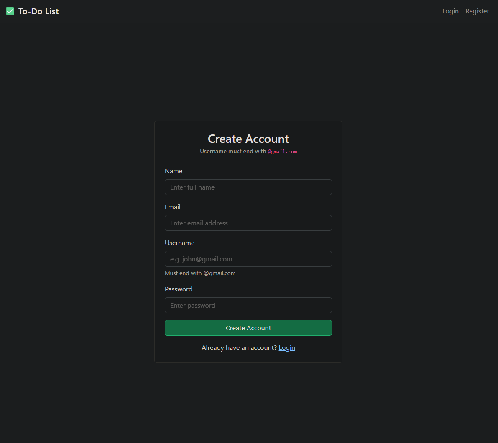
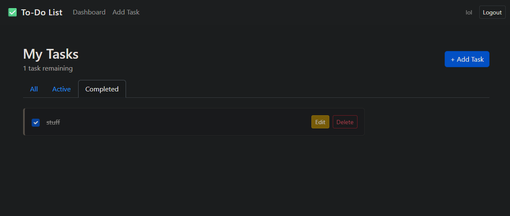
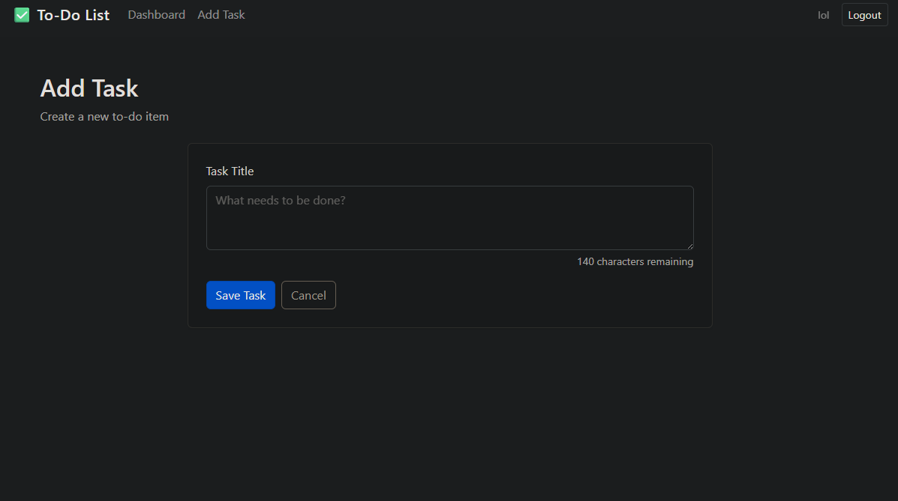

# To-Do List App

**[Live demo](https://to-do-tasks-szstanton.vercel.app/)**

A full-stack MERN task management application featuring secure user authentication, private task storage, and an intuitive interface for managing daily tasks. This project demonstrates a complete MERN stack build with JWT authentication, protected API routes, and persistent data storage, giving each user their own private task list.

### Before you try it

- The login page has a one click demo sign in, so you can look around without
  creating an account. Its tasks reset on every sign in.
- The API runs on a free tier that sleeps when idle, so the first load after a
  quiet spell can take up to a minute. The app pings it on load and shows a
  notice while it wakes, rather than leaving you waiting on a button.
- Accounts you create are removed after 60 days of inactivity, along with their
  tasks. Nothing personal is kept indefinitely.

## Screenshots

<table>
  <tr>
    <td></td>
    <td></td>
    <td></td>
  </tr>
</table>

## Features

- Secure user registration and login with hashed password validation
- JWT authentication and protected API routes
- Create, edit, complete, and delete tasks
- Filter tasks by All / Active / Completed
- Task counter showing tasks remaining
- Responsive React interface

## Tech Stack

**Frontend:** React, Context API, Vite

**Backend:** Node.js, Express, MongoDB, Mongoose, JWT

## Project Structure

**Frontend:** components, context, pages, App.jsx, main.jsx

**Backend:** config, middleware, models, routes, server.js

## Installation

1. Clone the repository and enter the folder

   ```bash
   git clone https://github.com/SZStanton/To-Do-Tasks
   cd To-Do-Tasks
   ```

2. Install dependencies. This is an npm workspace, so one install at the root
   covers the frontend and the backend

   ```bash
   npm install
   ```

3. Create the environment files from the examples

   ```bash
   cp server/.env.example server/.env
   cp client/.env.example client/.env
   ```

4. Fill in `server/.env` with your MongoDB connection string and a JWT secret. See
   [Environment variables](#environment-variables) below. Generate a secret with:

   ```bash
   node -e "console.log(require('crypto').randomBytes(48).toString('hex'))"
   ```

5. Start the API and the frontend together

   ```bash
   npm run dev
   ```

6. Open http://localhost:5173 in your browser

## Environment variables

`server/.env`

| Variable        | Required | Description                                                   |
| --------------- | -------- | ------------------------------------------------------------- |
| `MONGO_URI`     | yes      | MongoDB connection string, Atlas cluster or local mongod      |
| `JWT_SECRET`    | yes      | Long random string used to sign tokens                        |
| `PORT`          | no       | Port the API listens on, defaults to `5000`                   |
| `CLIENT_URL`    | no       | Frontend origin for CORS, defaults to `http://localhost:5173` |
| `DEMO_USERNAME` | no       | Username for the shared demo account                          |
| `DEMO_PASSWORD` | no       | Password for it. Public by design, never reuse a real one     |

`client/.env`

| Variable             | Required | Description                                       |
| -------------------- | -------- | ------------------------------------------------- |
| `VITE_API_URL`       | yes      | Base URL of the backend, no trailing slash        |
| `VITE_DEMO_USERNAME` | no       | Must match `DEMO_USERNAME`. Shows the demo button |
| `VITE_DEMO_PASSWORD` | no       | Must match `DEMO_PASSWORD`                        |

## Scripts

Run these from the project root.

| Script               | What it does                                  |
| -------------------- | --------------------------------------------- |
| `npm run dev`        | Runs the API and the frontend together        |
| `npm run dev:server` | API only                                      |
| `npm run dev:client` | Frontend only                                 |
| `npm start`          | Runs the API alone, used by the deployed host |
| `npm run build`      | Production build of the frontend              |
| `npm run lint`       | Lints the whole project                       |
| `npm run format`     | Formats the whole project with Prettier       |
| `npm run seed:demo`  | Creates or resets the shared demo account     |

## Future Improvements

- Task due dates and reminders
- Task categories/tags
- Drag-and-drop task reordering
- Dark/light mode toggle
